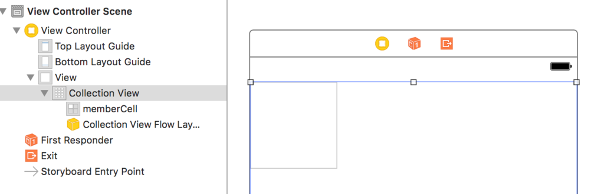

 # 近くのフレンズを探すアプリを作ろう！
こんにちは、masao です。今回は近くのフレンズを探せる<s>出会い系</s>アプリを作ってみましょう！

## APIの準備
### テーブルの用意
まずはアプリから叩く API にフレンズの位置情報を保存する DB を作成しておきます
今回はフレンズの座標(緯度経度)を Mysql の geometry型で保存します

```mysql
CREATE TABLE `members` (
  `id` int(10) unsigned NOT NULL AUTO_INCREMENT,
  `geometry` geometry NOT NULL,
  PRIMARY KEY (`id`),
  SPATIAL KEY `geometry` (`geometry`)
) ENGINE=MyISAM DEFAULT CHARSET=utf8;

```

### クエリの準備

続いては、自分の座標から自分以外の 1km 以内のフレンズを探すクエリを作るよ  
使う関数はこれだよ  

X = 経度だよ  
Y = 緯度だよ  
LINESTRING = POINTとPOINTを繋いだ線のことだよ  
GEOMFROMTEXT = geometry型に変換できるよ  
GLENGTH = LINESTRINGの長さを取得できるよ  

以上を使ってこんな感じのクエリを作成するよ

```mysql
Glength(GeomFromText('LineString(132.132521 32.703595, 113.151213 32.103456)'))
```

ただし、緯度経度はデータから取ってくるから CONCAT を使うよ

```mysql
Glength(GeomFromText(CONCAT('LINESTRING(', X( self.geometry ),' ', Y( self.geometry ), ",", X( other.geometry ), ' ', Y( other.geometry ), ')'))
```

これで自分とフレンズの距離が取れました！  
次はこの距離を使って 1km 以内の距離に絞り込みましょう  
1km は Glength にすると約 0.009 なので、これをもとに 1km 以内のフレンズを探しましょう！  

```mysql
SELECT
  friends.id,
  GLENGTH(GEOMFROMTEXT(CONCAT('LINESTRING(', X( self.geometry ),' ',Y( self.geometry ), ",", X( friends.geometry ),' ',Y( friends.geometry ), ')'))) AS distance
FROM 
  members AS self
    INNER JOIN 
  members AS friends
WHERE 
  self.id = 1 AND self.id != friends.id
ORDER BY 
  distance ASC
```

これで 1km 以内のフレンズが探せるようになったので API で叩いて取れるようにしておきましょう！(ry  

## アプリの準備
今回は Swift でアプリを作っていきます。UICollectionView を使って周りにいる人たちの画像を表示しましょう！

### StoryBoard
ViewController に CollectionView を設置していきます。  
CollectionViewCell に identifier を設定していきます。今回は memberCell にしました。  



### ViewController

ViewController で先ほど作った API を叩いてフレンズを取得します。 
取得したフレンズ を CollectionView に設置していきます。


```swift
import UIKit

class ViewController: UIViewController, UICollectionViewDataSource {
    
    private var nearlyFriends = Array()
    
    override func viewDidLoad() {
        super.viewDidLoad()
        
        // ここにAPIからフレンズを取得する処理(今回は省略)
        getNearlyFriends()
    }
    
    //フレンズの個数を返すメソッド
    func collectionView(_ collectionView: UICollectionView, numberOfItemsInSection section: Int) -> Int
    {
        // APIから取得してきたフレンズの個数を返す
        return nearlyFriends.count
    }
    
    
    //フレンズを返すメソッド
    func collectionView(_ collectionView: UICollectionView, cellForItemAt indexPath: IndexPath) -> UICollectionViewCell
    {
        //CollectionViewからセルを取得する。
        let cell = collectionView.dequeueReusableCell(withReuseIdentifier: "memberCell", for: indexPath) as UICollectionViewCell
        
        // APIから取得したフレンズから IndexPath 番目のデータを取得
        let friend = nearlyFriends[indexPath]
        
        // cell に取得したフレンズをもとに画像などを設定
        cell.backgroundView = friend.getImage()
    }
}
```

collectionView で画像を設定したり、距離を表示したりしてカスタマイズしていきましょう。

